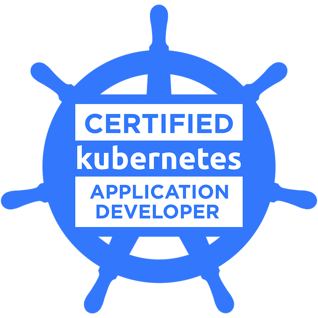

    

  

  Software Engineer
  
  
  
  
  ---

  

I'm also passionate about sharing my knowledge and experiences through writing. I'm currently working on a blog post series about messaging between Microservices. Stay tuned for some in-depth articles on this topic!

## 📫 How to Reach Me

  Email: yasin.herken123@gmail.com

  LinkedIn: [yasin-herken](https://www.linkedin.com/in/yasin-herken/)

📫 How to reach me: yasin.herken123@gmail.com

👨🏻‍💻 Most of my projects are available on <a href="www.github.com/yasin-herken">github</a>
  
  ---
  
  :fire: My Stats :

  

  
  ---

